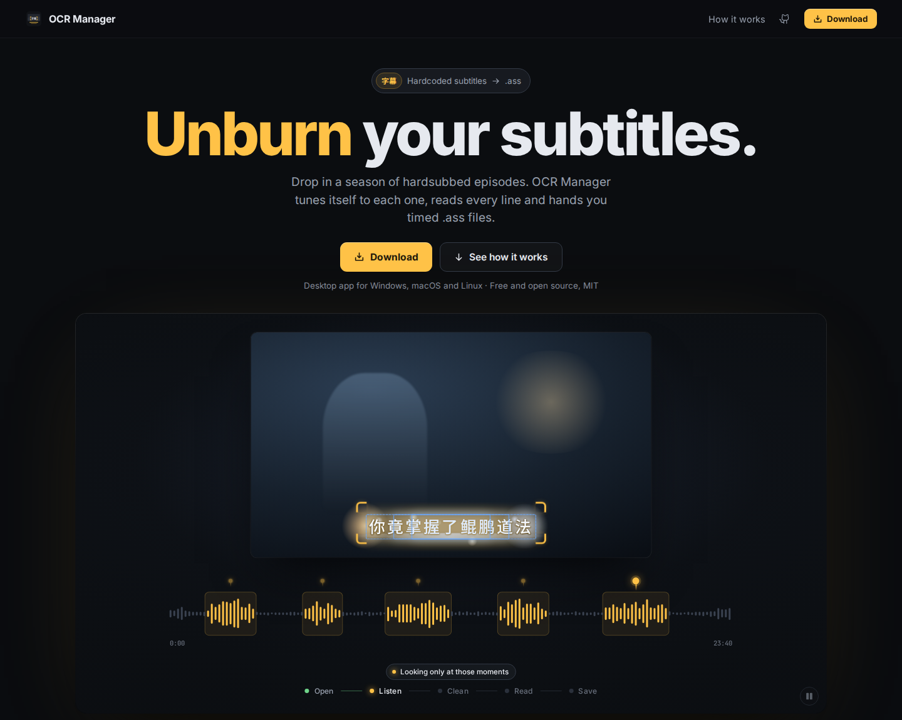

# OCR Manager

**Unburn your subtitles.** Drop in a season of hardsubbed episodes; OCR Manager tunes itself to each one, reads every line and hands you timed `.ass` files.

[](https://ocr-manager.blyat.uk/)

**Website: [ocr-manager.blyat.uk](https://ocr-manager.blyat.uk/)**

## Download

Get the latest build from the [releases page](https://github.com/blyat-uk/ocr-manager/releases/latest):

| OS | File |
|---|---|
| Windows 10/11 | `-win.exe` installer, or `-win.zip` portable |
| macOS 14.5+ (Apple Silicon) | `-mac.dmg` |
| Linux x86_64 | `-linux.AppImage`, or `-linux.tar.gz` portable |

On first launch the app downloads its OCR engine (PaddleOCR): the GPU build on a supported NVIDIA card, the CPU build otherwise. Run it with `--setup-engine` to switch later.

## Run from source

Python 3.11 or 3.12, and ffmpeg on your PATH.

```bash
git clone https://github.com/blyat-uk/ocr-manager.git
cd ocr-manager
python3 -m venv .venv
.venv/bin/pip install paddlepaddle-gpu==3.3.0 -i https://www.paddlepaddle.org.cn/packages/stable/cu129/   # or: paddlepaddle==3.3.0 (CPU)
.venv/bin/pip install -r requirements.txt
.venv/bin/python main.py [folder]
```

## Develop

```bash
QT_QPA_PLATFORM=offscreen .venv/bin/python -m pytest tests/ -m "not slow"   # tests
.venv/bin/python tools/fidelity_check.py                                     # golden OCR output
python packaging/build.py                                                     # release build for this OS
```

Pushing a `vX.Y.Z` tag that matches `app/version.py` builds, tests and publishes a release for all three platforms.

## License

[MIT](LICENSE)
