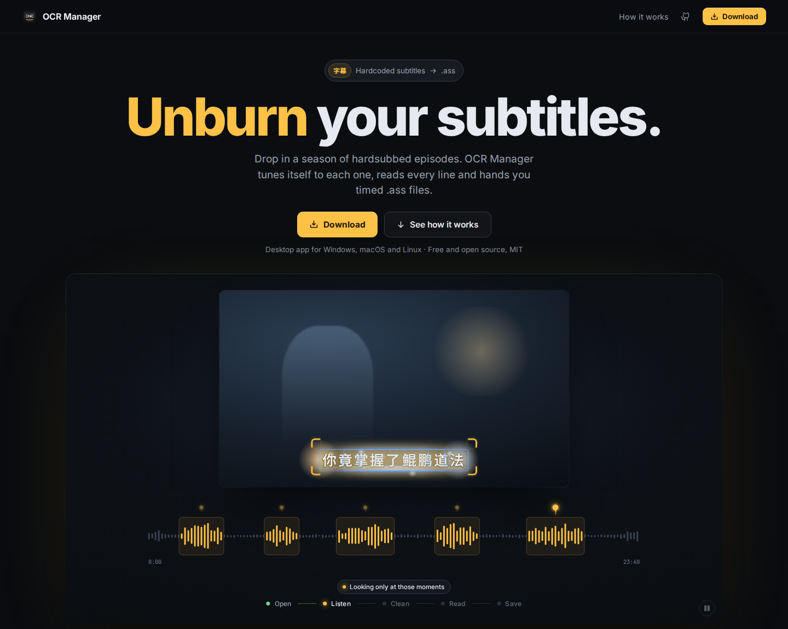

# OCR Manager

**Unburn your subtitles.** Drop in a season of hardsubbed episodes; OCR Manager tunes itself to each one, reads every line and hands you timed `.ass` files.

[](https://ocr-manager.blyat.uk/)

**Website: [ocr-manager.blyat.uk](https://ocr-manager.blyat.uk/)**

## Download

Get the latest build from the [releases page](https://github.com/blyat-uk/ocr-manager/releases/latest):

| OS | File |
|---|---|
| Windows 10/11 (x64) | `-win.exe` installer (per-user, no admin rights needed), or `-win.zip` portable |
| macOS 14.5+ (Apple Silicon) | `-mac.dmg` |
| Linux x86_64 | `-linux.AppImage`, or `-linux.tar.gz` portable |

Each release lists every file and what it is for, plus `SHA256SUMS.txt` to verify them against.

## First run

The OCR engine (PaddlePaddle) is not in the download; OCR Manager installs it the first time it starts. On an NVIDIA GPU with a recent driver it picks the matching CUDA build (2–5.5 GB to download, up to 8 GB on disk) and checks that it works; otherwise, or if the GPU check fails, it installs the CPU build (about 0.2 GB). Run it with `--setup-engine` to switch between GPU and CPU later.

The engine and the OCR models live in your user data folder, not in the app:

| OS | Data folder |
|---|---|
| Windows | `%LOCALAPPDATA%\ocr-manager` |
| macOS | `~/Library/Application Support/ocr-manager` |
| Linux | `~/.local/share/ocr-manager` |

## Platform notes

- **Windows:** the installer is not code-signed; SmartScreen may ask you to confirm (More info → Run anyway).
- **macOS:** the app is not notarized. Open it once with right-click → Open, or allow it under System Settings → Privacy & Security, or run `xattr -dr com.apple.quarantine "/Applications/OCR Manager.app"`.
- **Linux:** needs an X11 or Wayland desktop and glibc 2.34+; on X11 install `libxcb-cursor0` if the window does not open.

## Run from source

Python 3.11 or 3.12, and ffmpeg on your PATH.

```bash
git clone https://github.com/blyat-uk/ocr-manager.git
cd ocr-manager
python3 -m venv .venv
.venv/bin/pip install paddlepaddle-gpu==3.3.0 -i https://www.paddlepaddle.org.cn/packages/stable/cu129/   # or: paddlepaddle==3.3.0 (CPU)
.venv/bin/pip install -r requirements.txt
.venv/bin/python main.py [folder]
```

## Develop

```bash
QT_QPA_PLATFORM=offscreen .venv/bin/python -m pytest tests/ -m "not slow"   # tests
.venv/bin/python tools/fidelity_check.py                                     # golden OCR output
python packaging/build.py                                                     # release build for this OS
```

Pushing a `vX.Y.Z` tag that matches `app/version.py` builds, tests and publishes a release for all three platforms.

## License

[MIT](LICENSE)
